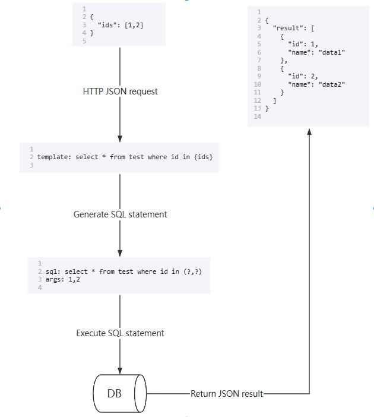

# SqlMidway

### 一个可根据SQL模板配置自动实现HTTP增删改查接口的数据库网关。
### 类似于Elasticsearch的查询模板功能。

***

## 特点

* 可根据SQL模板+JSON请求参数自动生成SQL语句并执行，以JSON形式响应结果。
* 可自定义响应字段的格式及数量（下划线及大小驼峰转换、不返回指定字段、只返回指定字段）。
* 使用参数化查询，防SQL注入，可直接开放给前端使用，可用于快速构建小型服务端项目。



***

## 使用方式

### 快速开始

#### 修改config.yaml中的dbs参数，新建一个名为testDB的数据库连接，并为其配置三个接口

```yaml
# 数据库信息（可配置多个）
dbs:

    # 数据库名称（自定义，确保唯一）
  - name: testDB
    type: mysql
    dsn: root:123456@tcp(127.0.0.1:3306)/test_db?charset=utf8mb4&parseTime=True&loc=Local

    # 接口分组信息（可配置多个）
    groups:
      
        # 分组名称（自定义，确保在该数据库下唯一）
      - name: testGroup
        # 返回的字段名转为小驼峰 (支持大小驼峰及下划线: lowerCamel,upperCamel,underscore)
        format: lowerCamel

        # 接口信息（可配置多个）
        apis:

            # 第一个接口: /query/testDB/testGroup/listByIdOrName
            # 接口名称（自定义，确保在该分组下唯一）
          - name: listByIdOrName
            # SQL模板（类似ES查询模板）
            sql: select * from test where 0=0 {#name} and name like {name} {/name} {#id} and id = {id} {/id} {#size} limit {size} {/size}

            # 第二个接口: /query/testDB/testGroup/listByIds
          - name: listByIds
            sql: select * from test where id in {ids}
            
            # 第三个接口: /command/testDB/testGroup/editNameById
          - name: listByIds
            sql: update test set name = {name} where id = {id} limit 1
```

#### SQL模板规则解释

* 例如模板：
```
select * from test where 0=0 {#name} and name like {name} {/name} {#id} and id = {id} {/id}
```
* 当id参数未传入时，'{#id} and id = {id} {/id}' 这一语句会在执行时被剔除
* 当id传入，name未传入时，则生成的SQL语句为：
```
select * from test where 0=0 and id = ?
```

#### 启动项目

* 运行 main.go

#### 访问第一个HTTP接口

查询接口路径：/query/{db.name}/{group.name}/{api.name}，插入/更新/删除接口路径：/command/{db.name}/{group.name}/{api.name}

> http://127.0.0.1:8899/query/testDB/testGroup/listByIdOrName

* 请求

```json
{
  "name": "%test%",
  "size": 10
}
```

* 响应

```json
{
  "result": [
    {
      "createdAt": "2023-12-09T16:12:31+08:00",
      "id": 1,
      "name": "[test]data1",
      "status": 2,
      "tag": "test",
      "updatedAt": "2023-12-09T17:19:15+08:00"
    },
    {
      "createdAt": "2023-12-09T17:14:08+08:00",
      "id": 2,
      "name": "[test]data2",
      "status": 1,
      "tag": "test",
      "updatedAt": "2024-01-28T02:08:41+08:00"
    }
  ]
}
```

* 如果这个请求是个写入性请求（调用了/command/xxx/xxx/xxx接口），则响应结构如下

```json
{
  "result": {
    "rowsAffected": 0,
    "lastInsertId": 0
  }
}
```

* 如果请求异常，会响应报错信息，响应结构如下

```json
{
  "error": "Error 1064 (42000): You have an error in your SQL syntax; check the manual that corresponds to your MySQL server version for the right syntax to use near '{ids}' at line 1"
}
```

***

### 控制字段的返回数量及格式 (类似于Graphql)

#### 不返回id和name字段（URI中传入hide参数）

> http://127.0.0.1:8899/query/testDB/testGroup/listByIdOrName?hide=id,name

* 请求

```json
{
  "id": 1
}
```

* 响应

```json
{
  "result": [
    {
      "createdAt": "2023-12-09T16:12:31+08:00",
      "status": 2,
      "tag": "test",
      "updatedAt": "2023-12-09T17:19:15+08:00"
    }
  ]
}
```

#### 将返回字段的格式设为大驼峰, 只返回Id和Name字段（URI中传入format和show参数）

> http://127.0.0.1:8899/query/testDB/testGroup/listByIdOrName?format=upperCamel&show=Id,Name

* 请求

```json
{
  "id": 1
}
```

* 响应

```json
{
  "result": [
    {
      "Id": 1,
      "Name": "[test]data1"
    }
  ]
}
```

***

### 支持in查询

#### 传入数组参数

* SQL模板

```yaml
sql: select * from test where id in {ids}
```

* 请求

```json
{
  "ids": [
    1,
    2
  ]
}
```

***

## 查看日志

* /logs/runtime.log